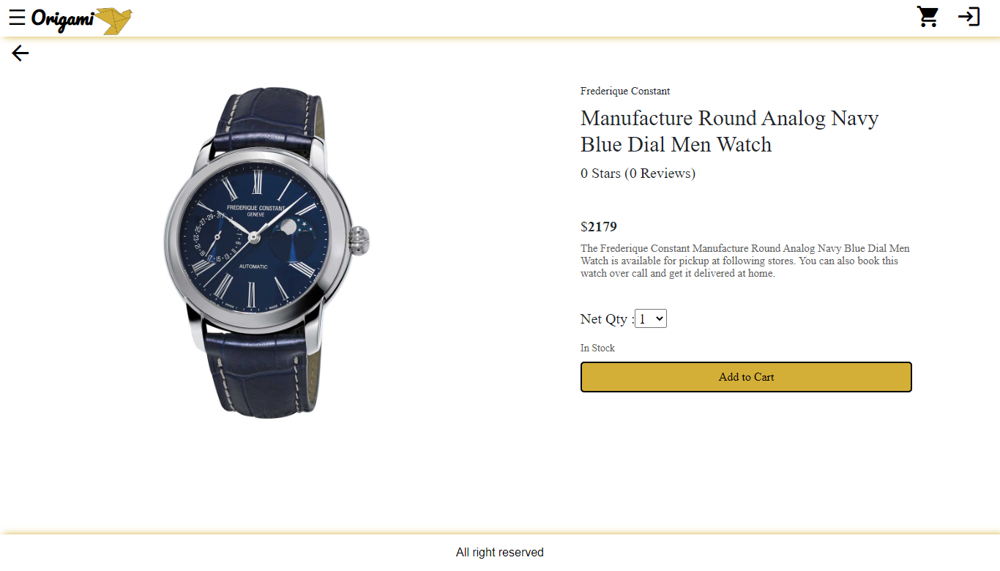
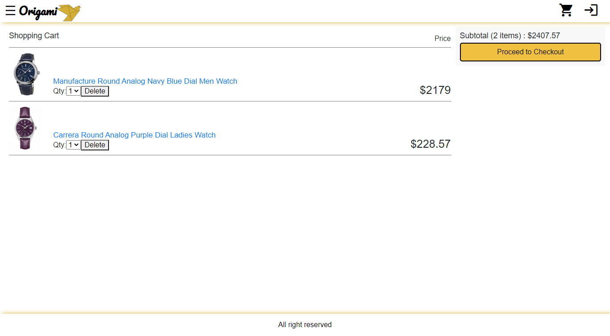
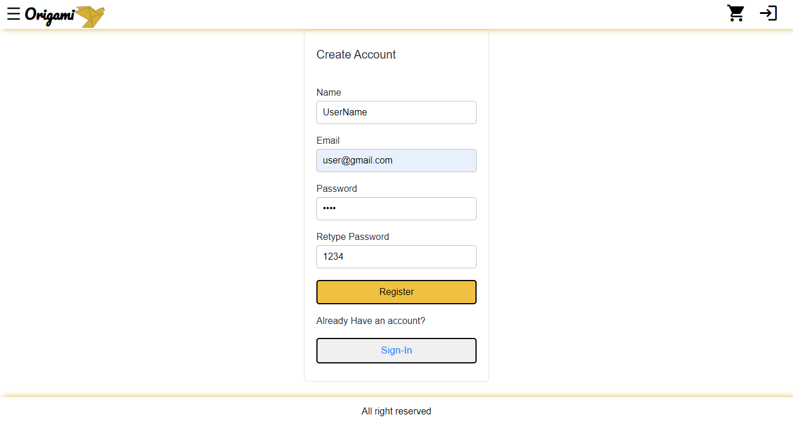
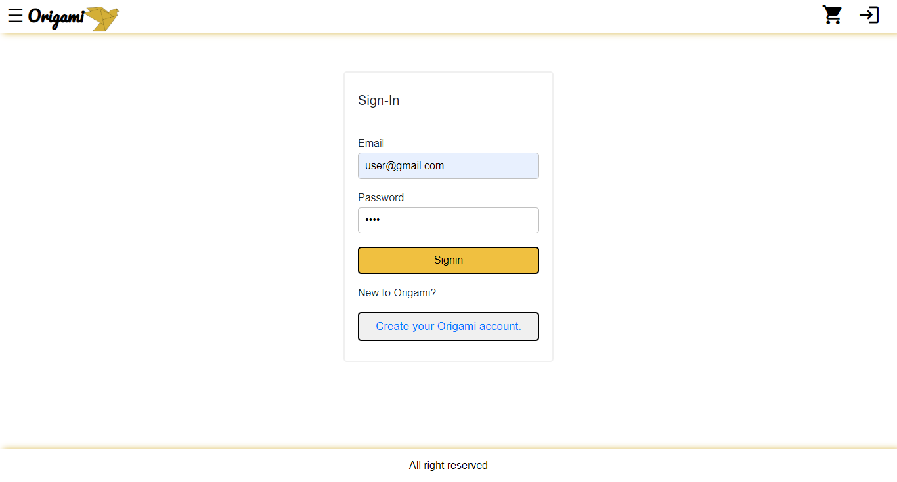
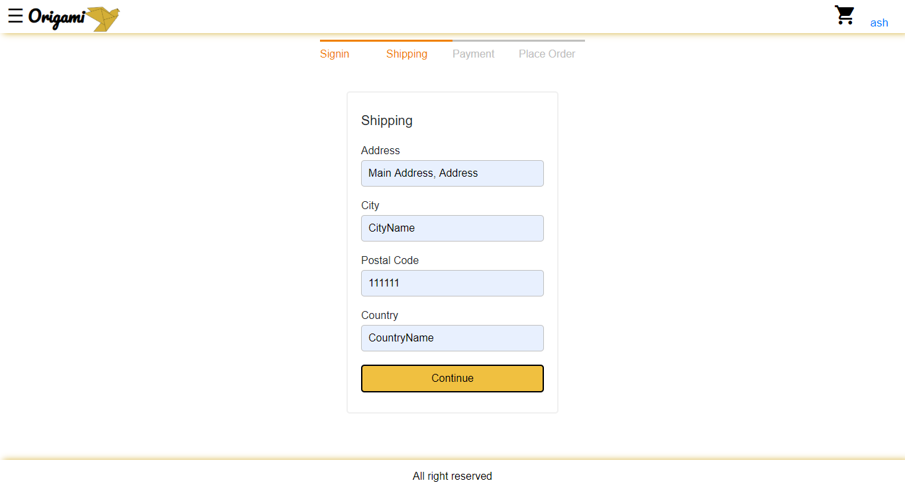
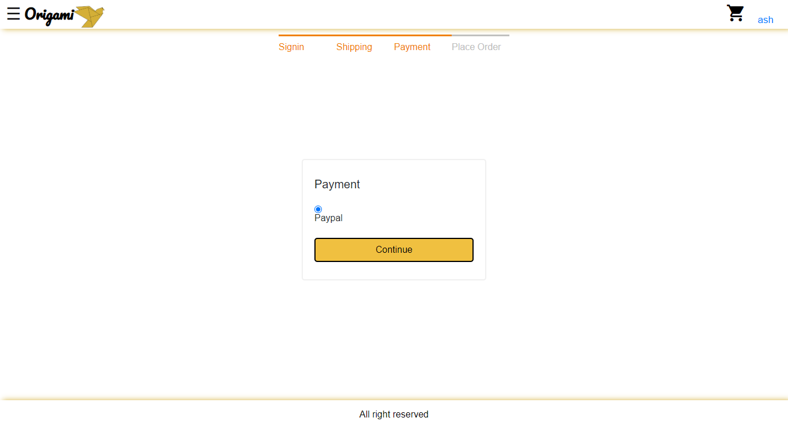
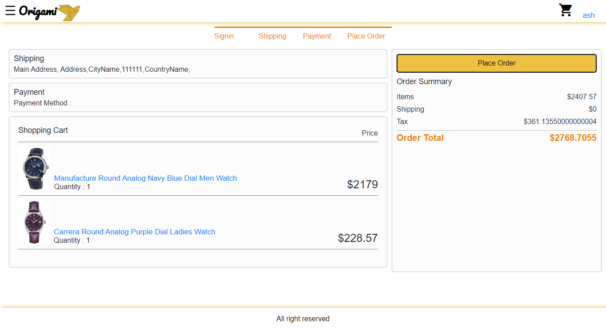
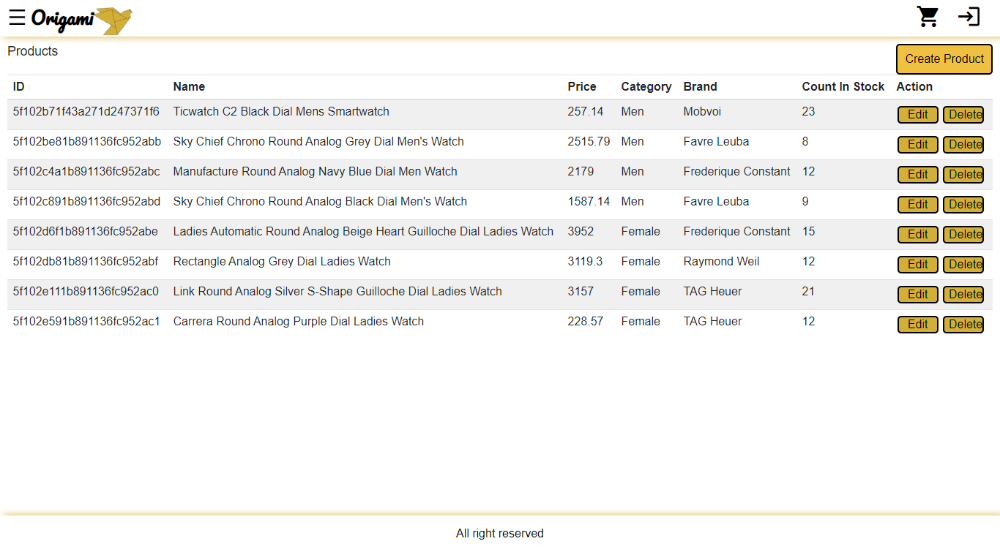
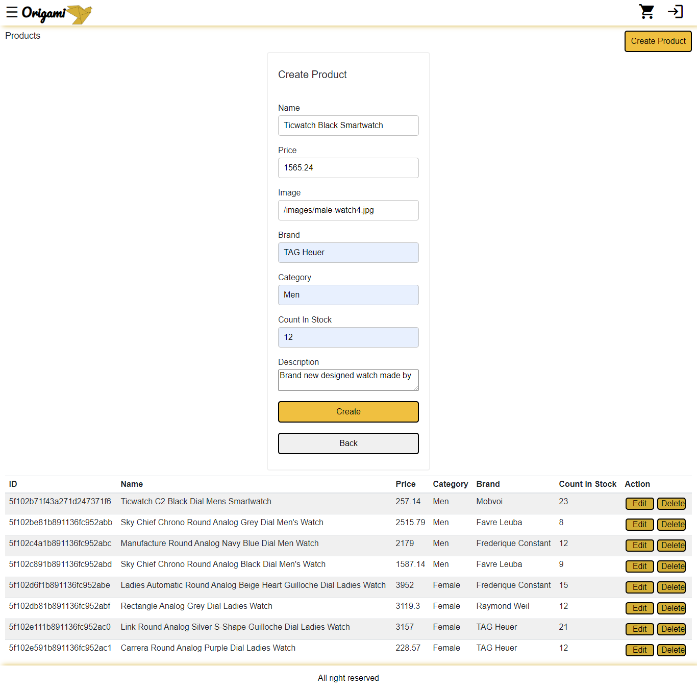

#  E-Commerce Website using MERN Stack.
A E-Commerce website developed using ReactJS for the frontend, NodeJs for the backend, MongoDB as database.


## Table of contents
* [Prerequisites](#prerequisites)
* [Requirements](#requirements)
* [Technologies](#technologies)
* [Features](#features)
* [Screenshots](#screenshots)
* [Contact](#contact)


## Prerequisites
- Text Editor ([VS Code](https://code.visualstudio.com/download) , [Atom](https://atom.io/), [Brackets](http://brackets.io/), etc.)
- Node.js and npm - [install here](https://www.npmjs.com/get-npm)
- MongoDB - [install here](https://docs.mongodb.com/manual/installation/)


## Requirements
To run this project, install it locally using npm:

- git clone git@github.com:suhassalian27/E-Commerce-Website-using-ReactJS-NodeJS.git
```
  $ cd E-Commerce-Website-using-ReactJS-NodeJS
```
- To Run Backend
  - open terminal 
```
  $ npm install
  $ npm start
```
- To Run Frontend
  - open new terminal
```
  $ cd frontend
  $ npm install
  $ npm start
```

## Technologies
Project is created with:
* HTML5 and CSS3: Semantic Elements, CSS Grid, Flexbox
* React: Components, Props, Events, Hooks, Router, Axios, React-Bootstrap
* Redux: Store, Reducers, Actions
* Node & Express: Web API, Body Parser, File Upload, JWT
* MongoDB: Mongoose
* Development: ESLint, Babel, Git, Github,
* Deployment: 

## Features
List of features ready and TODOs for future development
* User Login, Signup, User Authentication.
* Admin Login.
* Add, Edit, Remove Products. (Only Admin)
* Add to Cart.

To-do list:
* Sorting
* Search

## Screenshots

### Home Page
This is the home page of e-commerce. It shows a list of products. It also uses React-Bootstrap Corousel for corousel.


________________________________________________________

### Product Details Page
When the user clicks on a product it takes you to the product details page.


________________________________________________________

### Cart
Shopping Cart is the heart of any e-commerce website. I have created a user-friendly shopping cart using React and Redux.


________________________________________________________

### Register
I have created forms for getting user info and save them in the database.


________________________________________________________

### Sign-In
Sign in page for user to sign in.


________________________________________________________

## Ordering Products

Sign in page for user to sign in.

### Shipping Screen

________________________________________________________
### Payment Screen

________________________________________________________
### Place Order Screen

________________________________________________________

### Admin 
Admin should be able to define products and update the count in stock whenever they like. This page is about managing ECommerce products.

## View Products (admin)


________________________________________________________

### Add Products (admin)


________________________________________________________


## Contact
[Suhas Suhas](https://www.suhassalian.netlify.com/) - feel free to contact me!

<br><hr>

## 🚀 FYP Collection | Open Source & Professional
**Repository #5 of 37**

This project is proudly part of my curated **Final Year Projects (FYP) Collection**. I have organized and open-sourced this collection to showcase professional-grade development, modern architectural implementations, and scalable solutions.

🔗 **Repository Link:** [https://github.com/useratnns/fyp-E-Commerce-Website-using-ReactJS-NodeJS](https://github.com/useratnns/fyp-E-Commerce-Website-using-ReactJS-NodeJS)

---

### 👨‍💻 Developed By


### 🌐 Let's Connect (Contact Information)

Whether you need to integrate these links directly into your UI components or just want to connect, here are my official contacts:

``javascript
[
  { link: 'https://linkedin.com/in/musman100official', icon: '<i class="fab fa-linkedin-in"></i>' },
  { link: 'https://github.com/useratnns', icon: '<i class="devicon-github-original colored" style="filter: invert(1);"></i>' },
  { link: 'mailto:usmanboota.dev@gmail.com', icon: '<i class="fas fa-envelope"></i>' },
  { link: 'https://facebook.com/share/1E9deijpxL/', icon: '<i class="fab fa-facebook-f" style="color: #1877f2;"></i>' },
  { link: 'http://www.corecslab.com', icon: '<i class="fas fa-globe"></i>' },
  { link: 'https://instagram.com/callme_usman._', icon: '<i class="fab fa-instagram" style="color: #ec4899;"></i>' },
  { link: 'https://wa.me/923000437358', icon: '<i class="fab fa-whatsapp" style="color: #22c55e;"></i>' }
]
``
